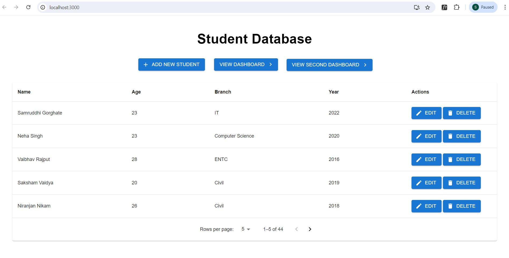
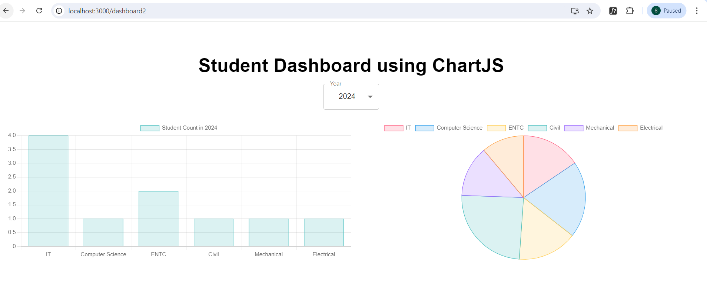
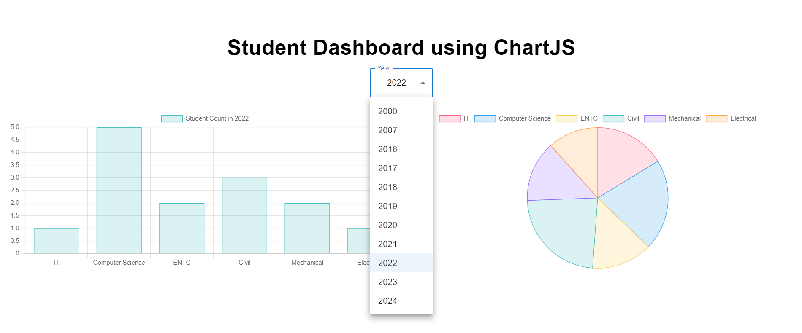
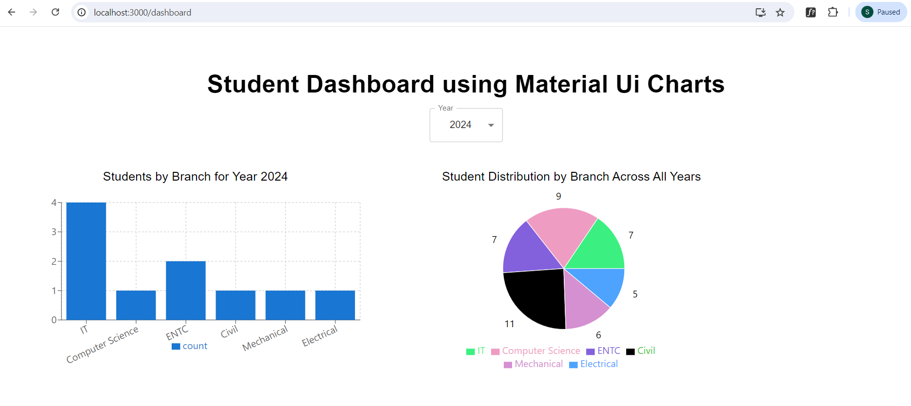
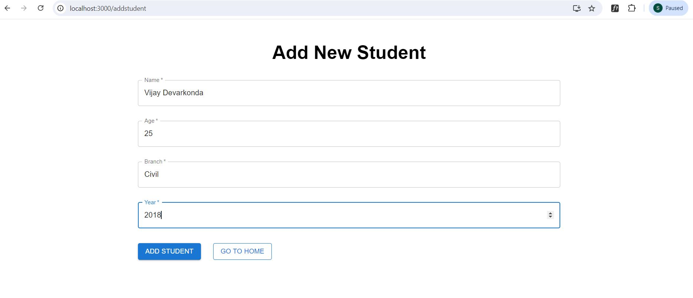
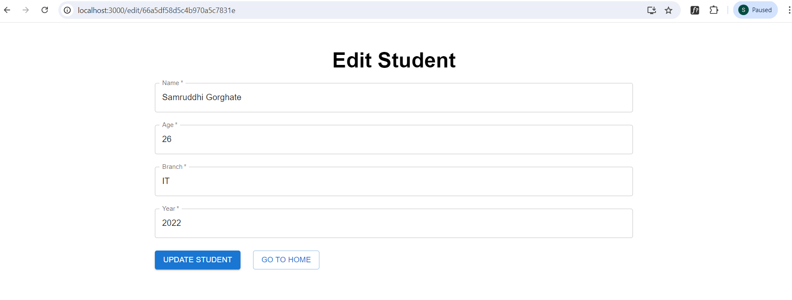

# Student Dashboard Project

This is a student dashboard project where users can perform CRUD operations, view a dashboard according to the selected year, and see students in every branch. The frontend is built with React, the backend with Express, and the database is MongoDB.

## Table of Contents

- [About the Project](#about-the-project)
- [Screenshots](#screenshots)
- [Folder Structure](#folder-structure)
- [Installation](#installation)
- [Usage](#usage)
- [Features](#features)
- [Contributing](#contributing)
- [License](#license)

## About the Project

This project is a comprehensive student management system. Users can add, edit, and delete student records, and visualize student data across different branches and years.

## Screenshots

_Dashboard showing student data by year_

_Dashboard showing student data by year using Chartjs_

_Select year from the dropdown_

_View addition information through tooltip_

_Form to edit student details_

_Form to add a new student_

_Form to edit student details_

## Features

- Add, edit, delete student records
- View student data by year and branch
- Visualize data using graphs
